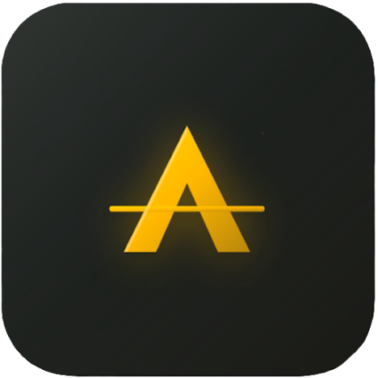

# Horizon: Strategic Intelligence Platform

Horizon is a high-performance, AI-driven market intelligence application designed for tactical traders and strategic investors. It synthesizes global news, geopolitical data, and market metrics into actionable intelligence.



## Core Value Proposition

Horizon transforms noise into signal. By leveraging specialized AI agents, the platform provides:

- **Strategic Sentiment Analysis (SNT)**: Moving beyond simple price action to understand the "why" behind market shifts.
- **Geopolitical Nexus**: Connecting global events directly to asset performance.
- **Alpha Discovery**: Identifying divergent opportunities before they hit mainstream headlines.

---

## 🏗️ System Architecture

The platform is built on a modern, distributed architecture:

### 1. Frontend (Flutter/Mobile)
A high-fidelity mobile application focused on "War Room" visibility and decision-making.
- **State Management**: [Riverpod](https://riverpod.dev/) for reactive, testable state handling.
- **Navigation**: [GoRouter](https://pub.dev/packages/go_router) for deep-linking and declarative routing.
- **UI Architecture**: Custom glassmorphism design system using high-contrast dark themes (Obsidian, Gold Amber, and Soft Crimson).
- **Data Visualization**: [FL Chart](https://pub.dev/packages/fl_chart) for tactical sparklines and detailed price action analysis.

### 2. Backend (Node.js/Express)
The orchestration layer for data ingestion and intelligence distribution.
- **Runtime**: Node.js with Express.js.
- **Database**: [MongoDB](https://www.mongodb.com/) via Mongoose for flexible storage of unstructured intelligence reports.
- **Security**: JWT-based authentication with [bcryptjs](https://www.npmjs.com/package/bcryptjs) and [Helmet](https://helmetjs.github.io/) for API protection.
- **Automation**: [node-cron](https://www.npmjs.com/package/node-cron) for scheduling AI-driven briefing cycles.

---

## 🚀 Key Features

### 📡 The War Room (Dashboard)
The central command center. Provides a "Daily Analysis" snapshot, highlighting the most critical intelligence category for the current market session.

### 🏛️ Intelligence Vault
A categorized archive of all AI-generated reports.
- **Strategic News Intel**: Global events and their market impact.
- **Market Analysis**: Deep dives into specific asset classes and tickers.
- **Alpha Opportunities**: High-signal divergent trades identified by the "Opportunity Scout" agent.

### 📈 Market Nexus
A tactical watchlist system tracking asset performance in real-time.
- **Sparklines**: Immediate visualization of recent price trends.
- **AI Strategic Signal**: Integrated ticker-level analysis within the asset detail view.
- **Sentiment Tracking**: Dynamic sentiment scores (SNT) displayed alongside price changes.

### 🛡️ Auth & Personalization
Secure login system with customizable intelligence topics. Users can follow specific "Trending Pillars" to tailor their briefing stream.

---

## 🛠️ Getting Started

### Prerequisites
- **Frontend**: Flutter SDK (Stable), CocoaPods (for iOS).
- **Backend**: Node.js (v18+), MongoDB (Local or Atlas).
- **Docker**: (Optional) For running the full stack using `docker-compose.yml`.

### Installation

1.  **Clone the repository**:
    ```bash
    git clone https://github.com/your-repo/AlphaHorizon.git
    cd AlphaHorizon
    ```

2.  **Backend Setup**:
    ```bash
    cd backend
    npm install
    # Configure your .env (see .env.example)
    node src/server.js
    ```

3.  **Frontend Setup**:
    ```bash
    cd frontend
    flutter pub get
    flutter run
    ```

---

## 📡 Deployment & Infrastructure

The project includes a `docker-compose.yml` for rapid deployment of the backend and database services. Production builds of the mobile app can be found in the `app-release.apk` (Android) or compiled via Xcode for iOS.

## 📄 License
AlphaHorizon is licensed under the ISC License. See the `backend/package.json` for more details.
